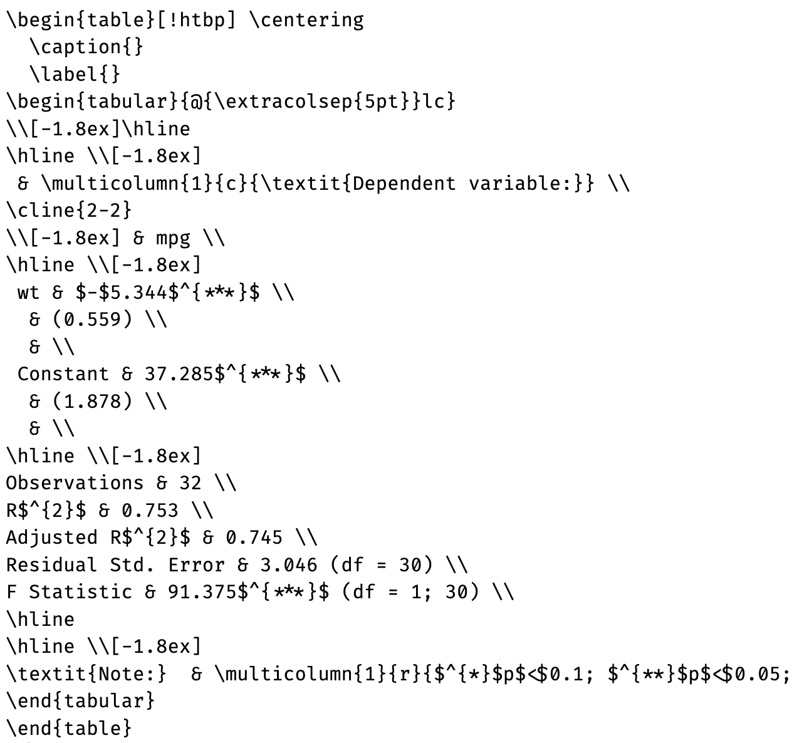
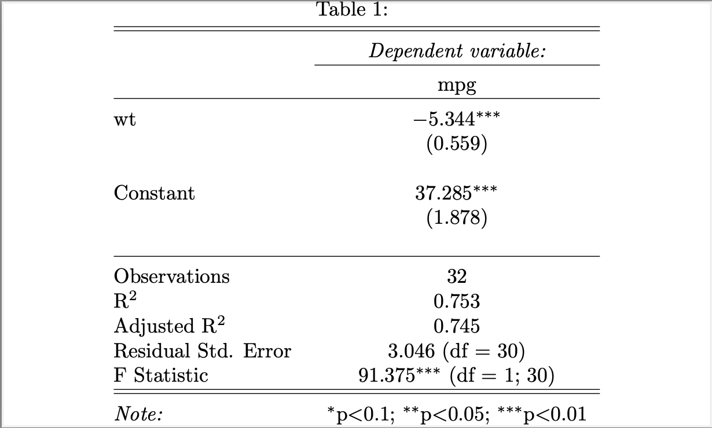

```{r setup, include=FALSE}
options(htmltools.dir.version = FALSE)
library(tidyverse)
library(xaringanExtra)
library(stargazer)
```

```{r xaringan-themer, include=FALSE, warning=FALSE}
library(xaringanthemer)
style_duo_accent(
  primary_color                = "#000000",
  secondary_color              = "#FFFFFF",
  link_color                   = "#0645AD",
  code_inline_background_color = "#CCCCCC",
  text_bold_color = NULL,
  header_font_google = google_font("Atkinson Hyperlegible"),
  text_font_google   = google_font("Atkinson Hyperlegible"),
  code_font_google   = google_font("Fira Code")
)
```

```{r xaringan-panelset, echo=FALSE}
xaringanExtra::use_panelset()
```

class: center, middle

# MIEF Skills Workshop: Modeling in R

## Session 2

### February 6, 2026

---

## Today

This course will involve less theory than the previous course. You should refer to the introductory R course if you're fuzzy on basic R details.

This course will be far more **practical**. I will be building an R script alongside you, as you build your own R script to "learn by doing."

.block-orange[
Today, we will be:
- Producing a simple estimates visualization from multiple regression outputs
- Exploring a simple method to output regression tables
- Iterating that method to work for multiple dependent variables
]

---

## Quick Refresh: Plots using `ggplot2`

The `ggplot2` package employs a plot *grammar* to create visualization by layering plot components.

.pull-left-wide[

```{r, eval = FALSE}
ggplot(mtcars) +
  geom_point(
    aes(
      x = mpg, y = wt,
      color = factor(cyl)
    ),
    size = 6
  ) +
  xlab("Miles/Gallon") +
  ylab("Weight") +
  scale_color_discrete(
    name = "# of Cylinders"
  ) +
  theme_minimal(base_size = 24) +
  theme(
    legend.position = "bottom"
  )
```

]

.pull-right-wide[

```{r, fig.align = "center", echo = FALSE}
ggplot(mtcars) +
  geom_point(
    aes(
      x = mpg, y = wt,
      color = factor(cyl)
    ),
    size = 6
  ) +
  xlab("Miles/Gallon") +
  ylab("Weight") +
  scale_color_discrete(name = "# of Cylinders") +
  theme_minimal(base_size = 24) +
  theme(
    legend.position = "bottom"
  )
```

]

---

## Quick Refresh: Regression Tables using `stargazer`

The `stargazer` package converts regression outputs into LateX code, which can be used to produce academic-standard regression tables.

.pull-left-wide[

```{r, eval = FALSE}
sg_output <- stargazer(
  lm(mpg ~ wt, data = mtcars),
  header = FALSE
)

sg_output
```

]

.pull-right-wide[

```{r, echo = FALSE, out.width = "100%", fig.align = "center"}


```

]

---

## Quick Refresh: Regression Tables using `stargazer`

To produce LateX output, you can either (1) learn some LateX and export the `stargazer()` output as a .tex file, then use `tinytex::pdflatex()` to convert to PDF, or (2) copy/paste the `stargazer()` output in Overleaf.

```{r, eval = FALSE}
sg_output <- stargazer(
  lm(mpg ~ wt, data = mtcars),
  header = FALSE
)
sg_output_mod <- c(
  "\\documentclass[preview]{standalone}",
  "\\begin{document}",
  sg_output,
  "\\end{document}"
)
writeLines(sg_output_mod, "tables/sg_output.tex")
pdflatex(
  file     = "tables/sg_output.tex",
  pdf_file = "tables/sg_output.pdf"
)
```

---

## Quick Refresh: Regression Tables using `stargazer`

To produce LateX output, you can either (1) learn some LateX and export the `stargazer()` output as a .tex file, then use `tinytex::pdflatex()` to convert to PDF, or (2) copy/paste the `stargazer()` output in Overleaf.

```{r, echo = FALSE, out.width = "70%", fig.align = "center"}


```

---

class: middle

## Today's Practical Component

- You will be following my live coding and then replicating it on your script.

- This session will be building on last week's code. If you haven't completed last week's assignment yet in your own code, **you should use the `session1_template.R` script that is available on Canvas as the basis for today's session. Just download it, rename it to `session2.R`, then work from the bottom of the script.

- After each coding chunk, you will get 5-10 minutes to apply it to your script:
  - If you are not feeling confident in the live setting, you can exactly replicate what I am doing
  - If you would like to get a head start on your course assignment, you can apply the process I am following to **a different set of variables within the dataset**.
  
---

## Today's Practical Component
  
I am answering the research question: what relationship is there between a respondent's education level and how they raise their children? To do this, I am using Q275 (education level) as the independent variable, and Q7-17 (child values) as the dependent variables from the World Values Survey.

.block-orange[
For the purpose of today's session, I would recommend sticking to education level as the independent variable. Here are some other dependent variables you could consider using:
- Life-Importance Subjects (Q1-6)
- Neighbor Preferences (Q18-26)
- Trust in Other People (Q58-63)
- Confidence in Institutions (Q64-89, NOT with 82_suffix options)
- Organization Membership (Q94-104, NOT with _r suffix)
- Corruption Perception (Q113-117)
- Immigration Perception (Q122-129)
- Information Source (Q201-208)
- Elections Perception (Q224-233)
]

---

class: middle

## Today's Practical Componnent

.block-blue[
1- Setup

2- Import Data

3- Explore Data

4- Simple Regression — One Dependent Variable

5- Iterated Regressions — Multiple Dependent Variables

6- Outputting Iterated Regressions as a Dataset

<span style = "color:red;">7- Simple Regression Estimates Plot (ggplot2)</span>

<span style = "color:red;">8- Simple Regression Output Table (Stargazer and LateX)</span>

<span style = "color:red;">9- Iterated Regression Output Tables (Stargazer and LateX)</span>

]

---

class: middle, center

# Annex

## Survey Variable Details

---

### Life-Importance Subjects (Q1-6)

*For each of the following aspects, indicate how important it is in your life. Would you say it is very important, rather important, not very important or not important at all?*

- Dataset matching regex: `"q00[1-6]_life"`
- Values:
  - 0 — Not at all important
  - 1 — Not very important
  - 2 — Rather important
  - 3 — Very important
- Subjects:
  - Family
  - Friends
  - Leisure
  - Politics
  - Work
  - Religion
  
---

### Child Values (Q7-17)

*Here is a list of qualities that children can be encouraged to learn at home. Which, if any, do you consider to be especially important? Please choose up to five.*

- Dataset matching regex: `"q0(0[7-9]|1[0-7])_child"`
- Values:
  - 0 — Not mentioned
  - 1 — Important
- Subjects:
  - Good manners
  - Independence
  - Hard work
  - Responsibility
  - Imagination
  - Tolerance
  - Thrift
  - Perseverance
  - Faith
  - Selflessness
  - Obedience
  
---

### Neighbor Preferences (Q18-26)

*On this list are various groups of people. Could you please mention any that you would not like to have as neighbors?*

- Dataset matching regex: `"q0(1[8-9]|2[0-6])_neighbor"`
- Values:
  - 0 — Not mentioned
  - 1 — Mentioned
- Subjects:
  - Drugs addicts
  - People of a different race
  - People who have AIDS
  - Immigrants/Foreign workers
  - Homosexuals
  - People of a different religion
  - Heavy drinkers
  - Unmarried couples living together
  - People who speak a different language
  
---

### Trust in Other People (Q58-63)

*I'd like to ask you how much you trust people from various groups. Could you tell me for each whether you trust people from this group completely, somewhat, not very much or not at all?*

- Dataset matching regex: `"q0(5[8-9]|6[0-3])_trust"`
- Values:
  - 0 — Do not trust at all
  - 1 — Do not trust very much
  - 2 — Trust somewhat
  - 3 — Trust completely
- Subjects:
  - Family
  - Neighborhood
  - People you know personally
  - People you meet for the first time
  - People of another religion
  - People of another nationality
  
---

### Confidence in Institutions (Q64-89)

*I am going to name a number of organizations. For each one, could you tell me how much confidence you have in them: is it a great deal of confidence, quite a lot of confidence, not very much confidence or none at all?*

- Dataset matching regex: `"q0(6[4-9]|7[0-9]|8[0-9])_confidence"`
- Values:
  - 0 — None at all
  - 1 — Not very much
  - 2 — Quite a lot
  - 3 — A great deal
  
---

### Confidence in Institutions (Q64-89)

- Subjects:
<br>
.pull-left[
  - Churches
- Armed forces
- Press
- Television
- Labor unions
- Police
- Justice system
- Government
- Political parties
- Parliament
- Civil services
- Universities
- Elections
- Major companies
]
.pull-right[
  - Banks
- Environmental organizations
- Women's organizations
- Charities
- Major regional organizations (e.g. EU)
- United Nations (UN)
- International Monetary Fund (IMF)
- International Criminal Court (ICC)
- North Atlantic Treaty Organization (NATO)
- World Bank (WB)
- World Health Organization (WHO)
- World Trade Organization (WTO)
]
  
---

### Organization Membership (Q94-104)

*Now I am going to read out a list of voluntary organizations; for each one, could you tell me whether you are a member, an active member, an inactive member or not a member of that type of organization?*

- Dataset matching regex: `"q(09[4-9]|10[0-4])_member"`
- Values:
  - 0 — Don't belong
  - 1 — Inactive member
  - 2 — Active member
- Subjects:
  - Church or religion organization
  - Sport or recreational organization
  - Art, music, or educational organization
  - Labor union
  - Political party
  - Environmental organization
  - Professional organization
  - Charitable or humanitarian organization
  - Consumer organization
  - Self-helf or mutual aid group
  - Women's group
  
---

### Corruption Perception (Q113-117)

*Among the following groups of people, how many do you believe are involved in corruption? Tell me for each group if you believe it is none of them, few of them, most of them or all of them?*

- Dataset matching regex: `"q11[3-7]_corr"`
- Values:
  - 0 — None of them
  - 1 — Few of them
  - 2 — Most of them
  - 3 — All of them
- Subjects:
  - State authorities
  - Business executives
  - Local authorities
  - Civil service providers
  - Journalists and media
  
---

### Immigration Perception (Q122-129)

*From your point of view, what have been the effects of immigrants on the development of this country?*

- Dataset matching regex: `"q12[2-9]_immigr"`
- Values:
  - 0 — Disagree
  - 1 — Hard to say
  - 2 — Agree
- Subjects:
  - Fill useful jobs in the workforce
  - Strengthen cultural diversity
  - Increase the crime rate
  - Give asylum to political refugees
  - Increase the risks of terrorism
  - Help poor people establish new lives
  - Increase unemployment
  - Lead to social conflict
  
---

### Information Source (Q201-208)

*People learn what is going on in this country and the world from various sources. For each of the following sources, please indicate whether you use it to obtain information daily, weekly, monthly, less than monthly or never.*

- Dataset matching regex: `"q20[1-8]_info_source"`
- Values:
  - 0 — Never
  - 1 — Less than monthly
  - 2 — Monthly
  - 3 — Weekly
  - 4 — Daily
- Subjects:
  - Daily newspaper
  - TV news
  - Radio news
  - Mobile phone
  - Email
  - Internet
  - Social media
  - Talk with friends or colleagues
  
---

### Elections Perception (Q224-233)

*In your view, how often do the following things occur in this country’s elections?*

- Dataset matching regex: `"q2(2[4-9]|3[0-3])_elect"`
- Values:
  - 0 — Not at all often
  - 1 — Not often
  - 2 — Fairly often
  - 3 — Very often
- Subjects:
  - Votes are counted fairly
  - Opposition candidates are prevented from running
  - TV news favors the governing party
  - Voters are bribed
  - Journalists provide fair coverage of elections
  - Election officials are fair
  - Rich people buy elections
  - Voters are threatened with violence at the polls
  - Voters are offered a genuine choice in the elections
  - Women have equal opportunities to run the office
